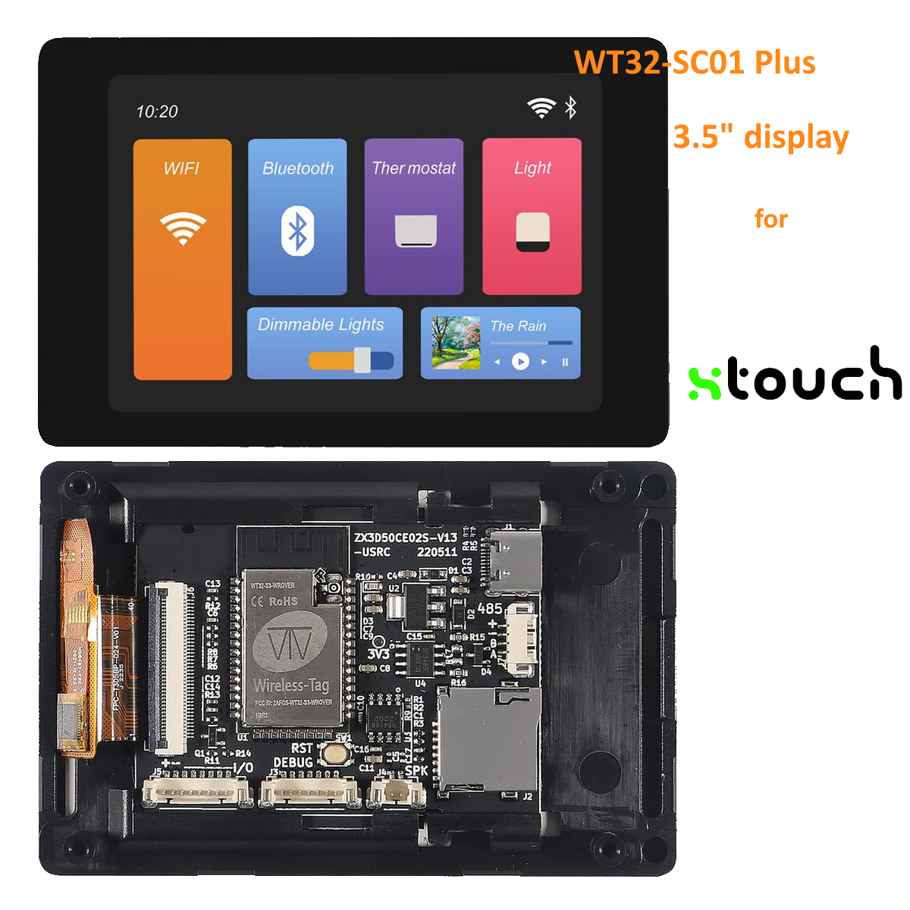
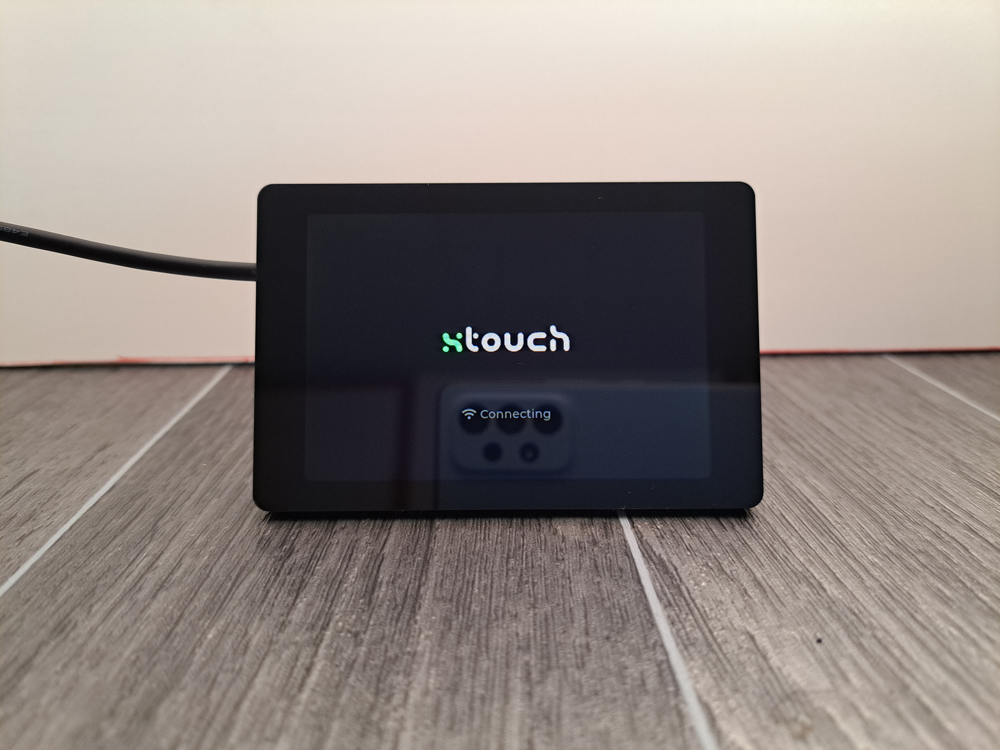
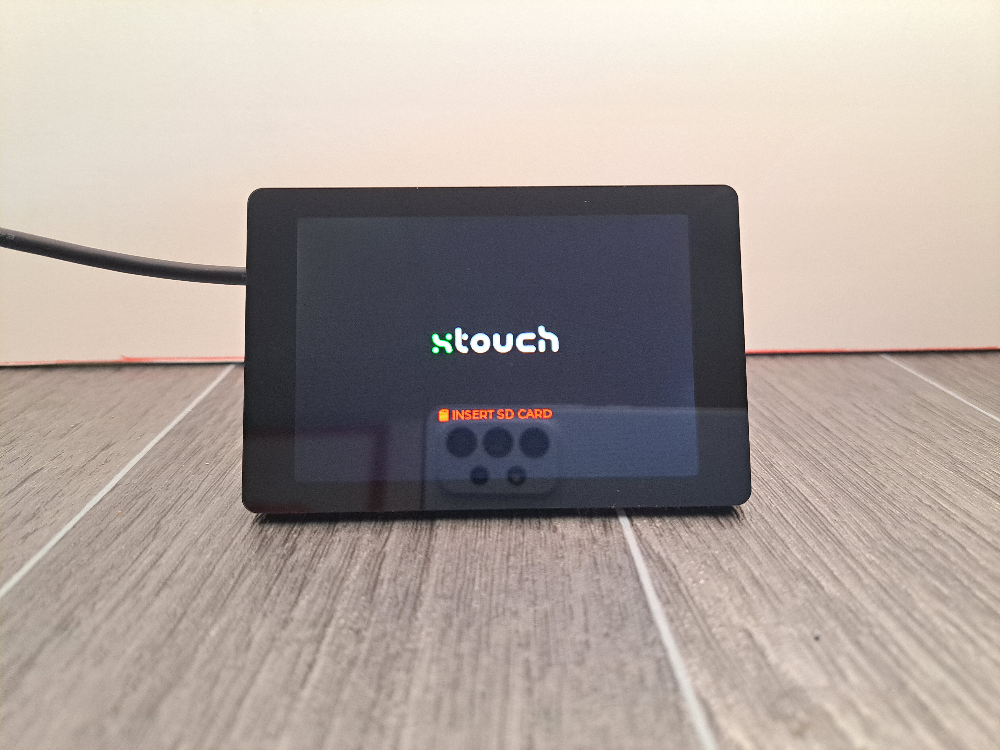
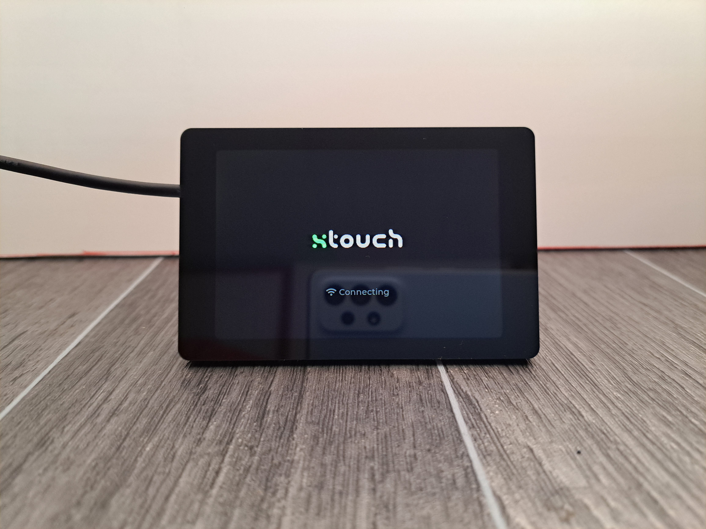

# Xtouch - WT32-SC01 Plus
| 3.5"     |
| ---      |

An implementation of a Xtouch display on a WT32-SC01 Plus. (Non-plus variant is not suitable)

A simple and cheap solution to use a dedicated touch screen to control and monitor a Bambulab 3d printer.

Usage:
- Clone the repository
- copy lv_conf.h to lvgl folder (which library PlatformIO will download)
- locate pins_arduino.h at YOUR USERNAME \.platformio\packages\framework-arduinoespressif32\variants\um_tinys3
- overwrite its content with the  pins_arduino.h found in devices\3.5 directory
- compile, flash, test
- do not forget to create a FAT32 SD card with your json format network config

Display used:
- [WT32-SC01 Plus](https://s.click.aliexpress.com/e/_DDUjTVb)

Deployed unit:
1                          |  2
:-------------------------:|:-------------------------:
|
|

ToDo - proper readme
